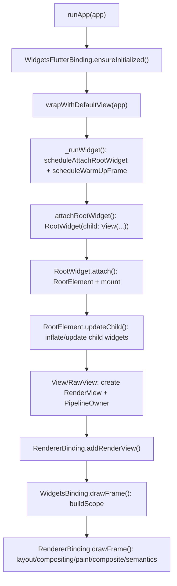

# Flutter 框架层启动流程与三棵树创建

本文从 [`ARCHITECTURE_INDEX.en.md`][arch-index] 中的 framework 层结构出发，结合少量源码确认启动主链路。这里的“三棵树”指 Flutter framework 经典的 `Widget` 树、`Element` 树和 `RenderObject` 树；当前源码还需要额外注意 `View`/`RawView` 对多视图和 `RenderView` 注册的参与。

## 1. 总览

框架层启动可以拆成三段：

1. Binding 初始化：`runApp` 先通过 [`widgets/binding.dart`][widgets-binding] 调用 `WidgetsFlutterBinding.ensureInitialized`，创建一个混入 gestures、scheduler、services、painting、semantics、rendering、widgets 能力的绑定对象。
2. 根 Widget 接入：`runApp` 把用户传入的根 widget 包进默认 `View`，再调度根节点挂载和 warm-up frame。
3. 首帧流水线：`RootWidget` 创建根 `Element`，`View`/`RawView` 创建并注册 `RenderView` 和子 `PipelineOwner`，随后 `drawFrame` 先 build，再 flush render pipeline。

简化链路如下：



## 2. Binding 初始化

`runApp` 的入口在 [`widgets/binding.dart`][widgets-binding]：它先取得 `WidgetsBinding` 实例，再调用 `_runWidget(binding.wrapWithDefaultView(app), binding, 'runApp')`。`WidgetsFlutterBinding.ensureInitialized` 在尚未初始化时构造 `WidgetsFlutterBinding`，这个类把 `GestureBinding`、`SchedulerBinding`、`ServicesBinding`、`PaintingBinding`、`SemanticsBinding`、`RendererBinding`、`WidgetsBinding` 混入到同一个 binding 实例中。

初始化过程中有两个关键状态：

- [`widgets/binding.dart`][widgets-binding] 的 `WidgetsBinding.initInstances` 创建 `BuildOwner`，并把 `onBuildScheduled` 指向 `_handleBuildScheduled`。`BuildOwner` 后续负责 dirty element 管理、build scope 和 tree finalization。
- [`rendering/binding.dart`][rendering-binding] 的 `RendererBinding.initInstances` 创建 `rootPipelineOwner`，注册 persistent frame callback，并把 root pipeline owner attach 到 binding 提供的 pipeline manifold。

所以 binding 初始化并不是只“拿一个单例”，而是建立 framework 与 engine/platform/scheduler/render pipeline 之间的公共协调对象。

## 3. runApp 与默认 View

当前版本的 `runApp` 会把用户根 widget 包进默认 `View`，这点由 [`widgets/binding.dart`][widgets-binding] 的 `wrapWithDefaultView` 完成。`View` 使用 `PlatformDispatcher.implicitView` 作为默认 `FlutterView`；如果平台处在没有 implicit view 的多视图模式，`runApp` 会抛错。对应地，`runWidget` 不自动选择 view，调用方需要自己在传入的树中放置至少一个 `View` 或 `ViewCollection`。

随后 `_runWidget` 做两件事：

- `scheduleAttachRootWidget(app)`：异步把根 widget 接到 `WidgetsBinding.rootElement`。
- `scheduleWarmUpFrame()`：调度 warm-up frame，让首帧构建和渲染尽快发生。

`scheduleAttachRootWidget` 最终调用 `attachRootWidget`，后者把传入 widget 包成 `RootWidget(debugShortDescription: '[root]', child: rootWidget)`，再交给 `attachToBuildOwner`。`attachToBuildOwner` 会设置 `_readyToProduceFrames = true`，调用 `RootWidget.attach(buildOwner!, rootElement as RootElement?)`，如果这是 bootstrap frame，还会调用 `SchedulerBinding.instance.ensureVisualUpdate()`。

## 4. Widget 树如何出现

`Widget` 树是配置树。`runApp(MyApp())` 传入的 `MyApp` 只是第一层配置；真正进入 framework 后会被包成类似：

```text
RootWidget
└─ View
   └─ RawView
      └─ MediaQuery / FocusScope / user app
```

如果用户根节点是 `MaterialApp`，它会在 [`material/app.dart`][material-app] 中构建 `WidgetsApp`，再通过 `_materialBuilder` 加入 `AnimatedTheme`、`ScaffoldMessenger`、默认选择样式等 Material 能力。`WidgetsApp` 自身在 [`widgets/app.dart`][widgets-app] 中根据配置构建 `Router` 或 `Navigator`，并包上 `Shortcuts`、`Actions`、`Localizations`、`FocusTraversalGroup` 等应用级基础设施。

需要区分的是：`Widget` 对象本身是不可变配置，build 时可频繁新建；它不是负责生命周期和状态保存的树。生命周期和复用主要在 `Element` 树中完成。

## 5. Element 树如何创建

`RootWidget.attach` 是 Element 树的 bootstrap 点。源码中如果还没有根 element，它会：

1. 调用 `createElement()` 创建 `RootElement`。
2. 调用 `element.assignOwner(owner)` 把根 element 交给 `BuildOwner`。
3. 在 `owner.buildScope(element!, () { element!.mount(null, null); })` 中 mount 根 element。

`RootElement` 的 `_rebuild` 会调用 `updateChild(_child, (widget as RootWidget).child, null)`，这会进入 [`widgets/framework.dart`][widgets-framework] 的 `Element.updateChild`。`updateChild` 是 Widget 树和 Element 树之间的核心 diff 点：

- 新 widget 为 `null` 时，旧 child 被 deactivate。
- 旧 element 可复用且 `Widget.canUpdate(oldWidget, newWidget)` 成立时，调用 `child.update(newWidget)`。
- 不可复用时，先 deactivate 旧 child，再通过 `inflateWidget(newWidget, newSlot)` 创建新 element。

因此 Element 树的创建不是一次性“照抄 Widget 树”，而是在每次 build 中通过 `updateChild` 和 `inflateWidget` 递归维护。`Element` 还实现 `BuildContext`，所以大多数 framework API 拿到的 `context` 实际上就是 Element 树上的节点。

## 6. RenderObject 树如何创建

不是所有 `Widget` 都会创建 `RenderObject`。只有 `RenderObjectWidget` 会在 [`widgets/framework.dart`][widgets-framework] 中声明 `createRenderObject` 和 `updateRenderObject`，并且总是 inflate 成 `RenderObjectElement` 子类。

`RenderObjectElement.mount` 是普通 render object 的创建点：它调用 `(widget as RenderObjectWidget).createRenderObject(this)` 得到底层 `RenderObject`，然后 `attachRenderObject(newSlot)` 把它挂到最近的祖先 `RenderObjectElement`。

根 render tree 的情况特殊：当前版本由 [`widgets/view.dart`][widgets-view] 的 `_RawViewInternal` 启动。它本身是一个 `RenderObjectWidget`，`createRenderObject` 返回 `RenderView(view: view)`；对应的 `_RawViewElement.mount` 会：

1. 设置 `_effectivePipelineOwner.rootNode = renderObject`，让该 `PipelineOwner` 管理这个 render tree。
2. 调用 `parentPipelineOwner.adoptChild(_effectivePipelineOwner)`，把子 pipeline owner 接入父 pipeline owner 树。
3. 调用 `RendererBinding.instance.addRenderView(renderObject)`，把 `RenderView` 注册到 binding。
4. 调用 `_updateChild()` 继续构建 `RawView` 下面的 widget/element 子树。
5. 调用 `renderObject.prepareInitialFrame()`，安排初始 layout 和 paint。

`RendererBinding.addRenderView` 位于 [`rendering/binding.dart`][rendering-binding]，会记录 `RenderView`，并通过 `createViewConfigurationFor` 设置 view configuration。`RenderView` 本身在 [`rendering/view.dart`][rendering-view] 中定义，`prepareInitialFrame` 会调用 `scheduleInitialLayout()` 和 `scheduleInitialPaint(...)`；真正出图时，`compositeFrame` 构建 scene 并调用底层 `FlutterView.render`。

## 7. 首帧 build 与 render pipeline

首帧以及后续每帧都走 `drawFrame`。[`widgets/binding.dart`][widgets-binding] 的 `WidgetsBinding.drawFrame` 先执行：

```text
buildOwner.buildScope(rootElement)
super.drawFrame()
buildOwner.finalizeTree()
```

这里的 `super.drawFrame()` 会落到 [`rendering/binding.dart`][rendering-binding] 的 `RendererBinding.drawFrame`，其顺序是：

```text
rootPipelineOwner.flushLayout()
rootPipelineOwner.flushCompositingBits()
rootPipelineOwner.flushPaint()
for each RenderView: renderView.compositeFrame()
rootPipelineOwner.flushSemantics()
```

`PipelineOwner` 在 [`rendering/object.dart`][rendering-object] 中说明可以组织成树，每个 pipeline owner 管理一个 render tree；flush 时先处理自己管理的 render tree，再递归处理 child pipeline owners。`View` 把每个 `RenderView` 对应的 pipeline owner 接到 `RendererBinding.rootPipelineOwner` 下，因此 framework 可以支持一个 Element 树关联多个 render trees。

## 8. 三棵树的关系

| 树 | 节点来源 | 持久性 | 主要职责 | 创建关键点 |
| --- | --- | --- | --- | --- |
| Widget 树 | 用户代码与 framework 的 `build` 返回值 | 轻量、不可变、可频繁重建 | 描述 UI 配置 | `runApp` 传入根 widget，`MaterialApp`/`WidgetsApp` 等继续 build |
| Element 树 | 每个 widget 的 `createElement` | 持久，负责复用、生命周期、dirty 管理 | 连接 Widget 配置与真实对象，提供 `BuildContext` | `RootWidget.attach` 创建 `RootElement`，`Element.updateChild`/`inflateWidget` 递归维护 |
| RenderObject 树 | `RenderObjectWidget.createRenderObject` | 持久，按需更新 | layout、paint、hit test、semantics 基础 | `_RawViewInternal` 创建根 `RenderView`，普通 `RenderObjectElement.mount` 创建子 render objects |

核心关系可以理解为：

```text
Widget  --createElement/update-->  Element  --createRenderObject/updateRenderObject-->  RenderObject
```

但这个关系不是每层都一一对应。`StatelessWidget`、`StatefulWidget`、`InheritedWidget` 等通常只产生 Element，不直接产生 RenderObject；`View`/`RawView` 则在 Element 树的非渲染区中打开一个新的渲染区，并创建独立的 `RenderView` 根。

## 9. 当前源码里容易忽略的点

- `WidgetsBinding` 只管理一个根 Element 树，但 [`rendering/binding.dart`][rendering-binding] 明确支持多个 `RenderView` 和多个 render tree。
- `runApp` 隐式包 `View`；`runWidget` 不隐式包 `View`。分析启动流程时要先确认入口用的是哪一个。
- `RendererBinding.renderView` 和 `pipelineOwner` 仍存在兼容路径，但源码已经把“谁创建/注册 RenderView”的责任推给更高层的 `View`。
- `Widget` 树不是稳定的运行时状态容器。真正承载复用、依赖、dirty 标记、生命周期的是 Element 树。

[arch-index]: ../architecture/ARCHITECTURE_INDEX.en.md
[widgets-binding]: ../lib/src/widgets/binding.dart
[widgets-framework]: ../lib/src/widgets/framework.dart
[widgets-view]: ../lib/src/widgets/view.dart
[widgets-app]: ../lib/src/widgets/app.dart
[material-app]: ../lib/src/material/app.dart
[rendering-binding]: ../lib/src/rendering/binding.dart
[rendering-object]: ../lib/src/rendering/object.dart
[rendering-view]: ../lib/src/rendering/view.dart
