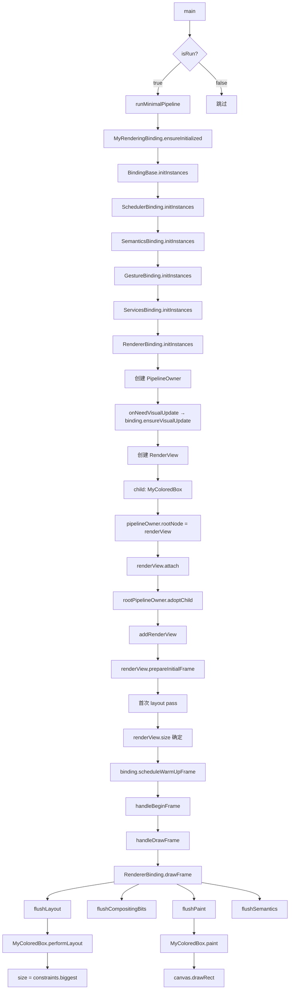

# 最小渲染管线 实现分析

## 1. 分析范围
- 本次只分析 `lib/min_framework/` 模块中手动组装 Flutter 渲染管线的完整流程
- 不覆盖 widget/Element 层（被故意绕过）、不覆盖多视图场景、不覆盖持续帧循环
- 项目总体索引入口：[ARCHITECTURE.md](../ARCHITECTURE.md)

## 2. 功能概览
这个模块演示了如何**绕过 widget/Element 层**，直接使用 Flutter framework 的渲染原语来组装一个完整的渲染管线。对外表现是：应用启动后在屏幕上绘制一个纯色矩形。

核心流程：初始化 binding → 创建 PipelineOwner → 构建 RenderView 树 → 注册到 binding → 首次布局 → 预热帧绘制。

## 3. 关键源码入口

| 文件 | 符号 | 作用 |
|---|---|---|
| [lib/min_framework/main.dart](../lib/min_framework/main.dart) | `main()` | 模块入口，`isRun` 守卫 + 委托到 `runMinimalPipeline()` |
| [lib/min_framework/minimal_pipeline.dart](../lib/min_framework/minimal_pipeline.dart) | `runMinimalPipeline()` | 核心编排函数，8 步组装渲染管线 |
| [lib/min_framework/my_rendering_binding.dart](../lib/min_framework/my_rendering_binding.dart) | `MyRenderingBinding` | 自定义 binding 类，组合 6 层 mixin |
| [lib/min_framework/my_rendering_binding.dart](../lib/min_framework/my_rendering_binding.dart) | `ensureInitialized()` | 单例工厂，触发完整初始化链 |
| [lib/min_framework/my_render.dart](../lib/min_framework/my_render.dart) | `MyColoredBox` | 自定义 RenderBox 子类 |
| [lib/min_framework/my_render.dart](../lib/min_framework/my_render.dart) | `performLayout()` | 计算 size = constraints.biggest |
| [lib/min_framework/my_render.dart](../lib/min_framework/my_render.dart) | `paint()` | 画纯色矩形 |

## 4. 主流程详解



### 4.1 起点 — Binding 初始化
```dart
final MyRenderingBinding binding = MyRenderingBinding.ensureInitialized();
```
- 触发 Dart mixin 线性化链：`BindingBase → SchedulerBinding → SemanticsBinding → GestureBinding → ServicesBinding → RendererBinding`
- 每个 mixin 的 `initInstances()` 按顺序被调用，完成各层初始化
- `ServicesBinding` 建立 binary messenger 和平台通道
- `SchedulerBinding` 建立帧调度器
- `RendererBinding` 建立 `rootPipelineOwner`

**与 framework 的对应关系**：`WidgetsFlutterBinding` 在此基础上额外混入 `WidgetsBinding` 来管理 `BuildOwner` 和 widget 树。

### 4.2 中间调度 — 创建管线组件
```
PipelineOwner(onNeedVisualUpdate)  → 管理本页面的渲染树
  ↓
RenderView(view, MyColoredBox)     → 渲染树的根节点
  ↓
pipelineOwner.rootNode = renderView → renderView.attach(pipelineOwner)
  ↓
binding.rootPipelineOwner.adoptChild(pipelineOwner)  → 纳入帧调度
  ↓
binding.addRenderView(renderView)   → 注册到 RendererBinding
```

- `PipelineOwner.onNeedVisualUpdate` 回调桥接到 `SchedulerBinding.ensureVisualUpdate()`，这样当渲染树需要重绘时能请求新帧
- `rootNode` setter 内部调用 `renderView.attach(pipelineOwner)`，将节点标记为需要 layout/paint
- `adoptChild` 让本地的 PipelineOwner 参与全局帧生产协调

### 4.3 核心实现 — 首次布局与预热帧
```
renderView.prepareInitialFrame()
  → 首次 layout pass
  → renderView.size 确定

binding.scheduleWarmUpFrame()
  → handleBeginFrame()（同步执行，不等待 vsync）
  → handleDrawFrame()
    → RendererBinding.drawFrame()
      → flushLayout()      → MyColoredBox.performLayout()
      → flushCompositingBits()
      → flushPaint()       → MyColoredBox.paint()
      → flushSemantics()
```

- `prepareInitialFrame()` 强制执行首次布局，确保 `renderView.size` 被计算
- `scheduleWarmUpFrame()` 是**同步预热帧**——锁定 vsync 后立即执行整个帧生命周期，不走正常的异步等待路径
- `drawFrame()` 的 4 个 flush 阶段按序执行，每个阶段只处理标记为 dirty 的节点

### 4.4 收尾 — 绘制到屏幕
- `MyColoredBox.paint()` 通过 `PaintingContext.canvas` 获得 `Canvas` 对象
- 调用 `canvas.drawRect(offset & size, paint)` 绘制纯色矩形
- 实际的屏幕输出由 engine 在 compositing 阶段完成

## 5. 关键实现细节

### 5.1 MyRenderingBinding 的 mixin 顺序是强制的
`RendererBinding` 声明了 mixin 约束 `on BindingBase, ServicesBinding, SchedulerBinding, GestureBinding, SemanticsBinding, HitTestable`，因此 `MyRenderingBinding` 的 mixin 列表**必须**包含所有这些类型，且 Dart 的线性化顺序必须满足约束。

当前顺序 `SchedulerBinding, SemanticsBinding, GestureBinding, ServicesBinding, RendererBinding` 是正确的——`HitTestable` 通过 `implements` 单独满足。

### 5.2 PipelineOwner 是渲染树的管理者
每个独立的 view/页面应有自己的 `PipelineOwner`。它管理：
- 哪些节点需要 layout（dirty layout 列表）
- 哪些节点需要 paint（dirty painting 列表）
- 何时触发 `onNeedVisualUpdate`

### 5.3 scheduleWarmUpFrame() 的特殊性
与正常帧不同的是，`scheduleWarmUpFrame()` **同步**处理整个帧，而不是注册回调等待下一个 vsync。这确保了首次绘制在 `main()` 返回前完成，避免白屏。

### 5.4 MyColoredBox 是最简 RenderBox
- 无子节点、无固有尺寸计算、无 hit testing
- `performLayout()` 的行为是"填满可用空间"——这是最简单的布局策略
- 这个实现足以验证 layout→paint 生命周期是否正常工作

## 6. 相关文件关系

| 文件 | 关系 | 说明 |
|---|---|---|
| [my_rendering_binding.dart](../lib/min_framework/my_rendering_binding.dart) | 主路径 | 提供 binding 基础设施 |
| [my_render.dart](../lib/min_framework/my_render.dart) | 主路径 | 提供渲染内容 |
| [minimal_pipeline.dart](../lib/min_framework/minimal_pipeline.dart) | 主路径 | 管线编排逻辑 |
| [main.dart](../lib/min_framework/main.dart) | 主路径 | 模块入口 + `isRun` 守卫 |
| [lib/main.dart](../lib/main.dart) | 支撑 | 薄入口，委托到 min_framework |
| `packages/flutter/lib/src/rendering/binding.dart` | 上下文 | RendererBinding 的 framework 实现 |
| `packages/flutter/lib/src/rendering/object.dart` | 上下文 | RenderBox/PipelineOwner 的 framework 实现 |

## 7. 时序总结

1. `main()` → `isRun` 检查通过 → 调用 `runMinimalPipeline()`
2. `MyRenderingBinding.ensureInitialized()` → 6 层 mixin 初始化完成
3. `PipelineOwner(onNeedVisualUpdate)` → 创建管线管理者
4. `RenderView(view, MyColoredBox)` → 构建渲染树
5. `pipelineOwner.rootNode = renderView` → 挂载根节点
6. `binding.rootPipelineOwner.adoptChild(pipelineOwner)` → 纳入帧调度
7. `binding.addRenderView(renderView)` → 注册到 binding
8. `renderView.prepareInitialFrame()` → 首次布局，确定 size
9. `binding.scheduleWarmUpFrame()` → 同步执行完整帧周期，触发 `MyColoredBox.performLayout()` 和 `paint()`

## 8. 边界情况与注意点

- **仅首次帧**：demo 只执行预热帧，不启动持续帧循环。后续帧不会自动触发。
- **无动态更新**：没有任何机制在预热帧之后触发 re-layout 或 re-paint，渲染树是静态的。
- **单视图**：仅使用 `PlatformDispatcher.implicitView`，多视图场景未涉及。
- **无命中测试**：`MyColoredBox` 未覆写 `hitTest`/`hitTestSelf`，所有指针事件会穿透。
- **`isRun` 开关**：全局 `isRun` 标志控制是否执行管线，设为 `false` 则整个 demo 不运行。

## 9. 关键证据

- `main()` 入口 + `isRun` 开关：[main.dart](../lib/min_framework/main.dart):1-8
- `runMinimalPipeline()` 编排函数：[minimal_pipeline.dart](../lib/min_framework/minimal_pipeline.dart):7-47
- `ensureInitialized()` 单例工厂：[my_rendering_binding.dart](../lib/min_framework/my_rendering_binding.dart):19-24
- mixin 组合声明：[my_rendering_binding.dart](../lib/min_framework/my_rendering_binding.dart):7-12
- performLayout 实现：[my_render.dart](../lib/min_framework/my_render.dart):9-13
- paint 实现：[my_render.dart](../lib/min_framework/my_render.dart):16-20
